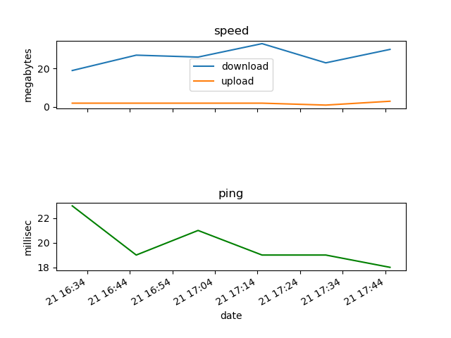

# connection_notifier
this simple project is meant to be run on any host (e.g. raspberry pi) which can use a speaker, and connect to your LAN.
it tests the connection using the speedtest library, and will notify (using text to speech) if something goes wrong. 
here's an image of a graph generated by the notifier: 

